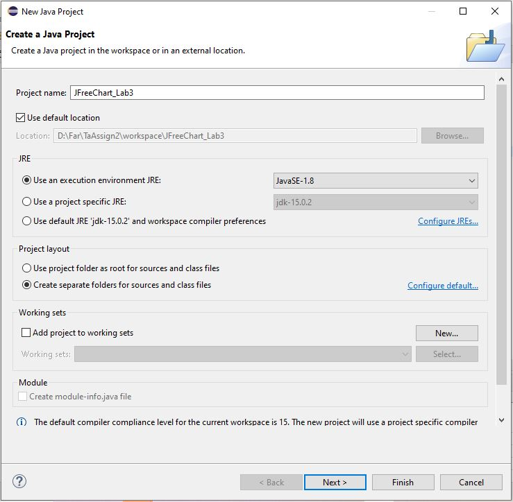
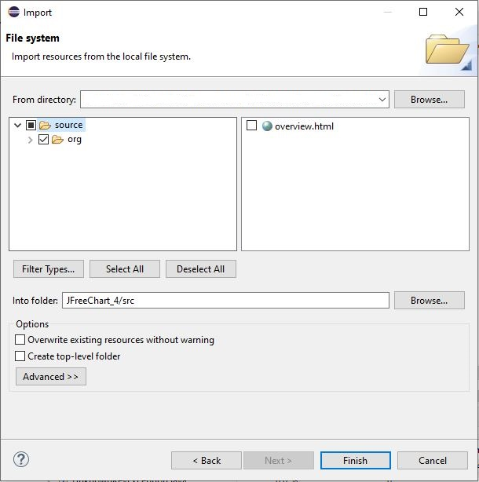
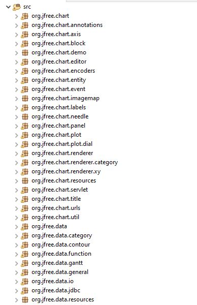
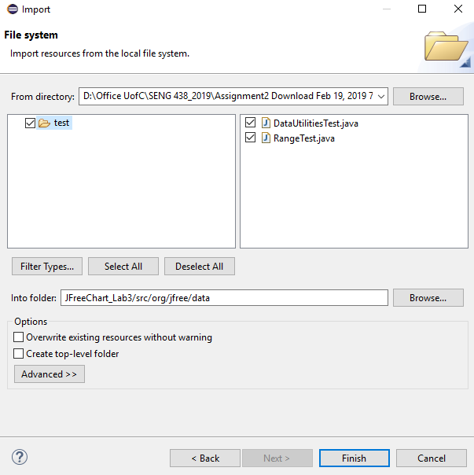
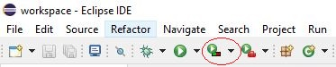

**SENG 637 - Dependability and Reliability of Software Systems**

## 1.3 Testing Tools

**List of code coverage tools:**

- **EclEmma** [(http://www.eclemma.org/](http://www.eclemma.org/)) --> (recommended tool)

# 2 Familiarization

ALL students should ensure that they understand the concepts in this section before moving on to the rest of the assignment.

1.  If you haven’t done so already, download the JFreeChart v2.0.zip file from Github repository [./seng637-a3-artifacts.zip](./seng637-a3-artifacts.zip).
2.  Extract the contents of the .zip file into a known location.

## 2.1 Create an Eclipse Project

1.  Open Eclipse.
2.  Open the _New Project_ dialog by selecting the _File -\> New -\> Project_…
3.  Ensure that _Java Project_ is selected and click _Next_.
4.  The dialog should now be prompting for the project name. Enter _JFreeChart_Lab3_ in the _Project Name_ field and click _Finish_
5.  Right click on the src folder of your project and click _import_
6.  In the _Import_ dialog, select the _File System_ option (in the _General_ category) and click _Next_.
7.  In the new panel on the _Import_ dialog, click on the _Browse…_ button, then navigate to the JFreeChart 1.0.19 directory and select _source_ folder.
8.  Expand the source folder in the left panel and select _org_, then click on _Finish_ button. You should see the same panel as Figure 2.

**NOTE:** You might need to follow the steps in assignment 2 for _Adding External Libraries_ so then you have the _External Libraries_ as well.

**Figure 1 - New Java Project dialog with name and source path filled in**

**Figure 2 - Import Source**

1.  The project (SUT) is now set up and ready for testing.

**Figure 3 - Part of packages and archives that should be included in the newly-created project**

## 2.2 Import a Test Suite

For the purpose of demonstrating the abilities of coverage tools, the test suite developed in Assignment 2 will be used.

1.  Copy and paste your test codes into test folder of your new project or
    follow the following steps to import them.

    - Right click on the org.jfree.data package in the _Package Explorer_. Select _Import…_.

    - In the _Import_ dialog, select the _File System_ option (in the _General_ category) and click _Next_.

    - In the new panel on the _Import_ dialog, click on the _Browse…_ button to choose the directory you import your files from, then navigate to the directory from your previous assignment containing your test files for Range and DataUtilites. Click _OK_.

    - Check your DataUtilities and Range test classes (something similar to what is shown in Figure 3 below). Then click _Finish_.

**Figure 3 - Import dialog with Assignment 2 test classes selected**

The test classes selected are now included in the org.jfree.data package in the new project. **_BUT: please make sure this is the case and that the package name in your test class is defined as org.jfree.data._**

**Note**:

- You should import jmock 2.x library as you did in Assignment 2
- If you want to use junit 4.x, you should import junit 4.x libraries as you did in Assignment 2
- You can find both libraries in [./seng637-a3-artifacts.zip](./seng637-a3-artifacts.zip).
- To run EclEmma code coverage on Eclipse, select coverage button> Coverage As> JUnit Test. Figure 4

**Figure 4 - Run EclEmma code coverage tool**

## 3.1 Measure Control Flow Coverage

**_This design component_** requires that you and your team measure the adequacy of your test suite using one or more code coverage tools and report about the pros and cons of your metrics and tool choices

Measurement of code coverage is performed in two main steps. First, classes must be selected for instrumentation. Classes selected for instrumentation are the classes which will have the coverage measured. Then, the test suite must be run with a coverage tool. You can use any coverage analysis tool. You need to report **three** **coverage** **metrics** (the suggested metrics to report are: statement, branch, and condition coverages).

- **NOTE 1:** If the coverage tool that you are using does not support any of the above metrics, first try another tool. If none reports the above measures, then replace the missing measure with another metric that the tool supports, e.g. you might decide to replace condition coverage with method coverage, if you are using EclEmma

- **NOTE 2:** Document all coverage tools you tried and what worked or did not work for your configuration. Explain what you fixed (e.g., removing mock objects, updating IDEs, switching to another tool, etc.)

- **NOTE 3:** You need to report the pros and cons of tools you tried and the metrics you chose.

> Read Section 3.3. for more details.

## 3.2 Measure Data Flow Coverage Manually

To become more familiar with data flow coverage and achieve a deeper understanding of how coverage tools work, calculate the DU-pair coverage for two methods, by hand. The methods to analyze are: DataUtilities.calculateColumnTotal and one method of your choice from the org.jfree.data.Range class (that you have a test set for, from Assignment 2). Calculate the DU-pair coverage by tracing through the execution of each of your test cases for these methods, manually. This will need to be included in your report. You need to report the followings per method:

- the data flow graph

- the def-use sets per statement

- list all DU-pairs per variable

- for each test case show which pairs are covered

## 3.3 Test Suite Development

In this section, you will be required to **design new unit tests** for two classes to increase their code coverage. The classes to be tested are: org.jfree.data.DataUtilities and org.jfree.data.Range. Note that although the focus in adequacy criteria has changed (it is now on source code), to develop new test cases the test oracle should still be derived from the requirements (as contained in the Javadocs of the SUT)

As with any testing to be done, to begin with, a plan must be created. Document this test plan, as it will be included with your lab report. This plan should include information about who will create which tests, how you plan to develop tests to achieve the adequacy criteria. For thiassignment, a test suite should be developed which has at least thfollowing coverage for each of the classes under test

Minimum coverage:

- 90% statement coverage

- 70% branch coverage

- 60% condition coverage

**Note**: If your initial test cases (the ones designed in assignment 2) already meet the above requirements, it is recommended that you still design new test cases and try to increase the coverage of your test cases.

Carry out your test plan, creating tests for all methods. As a good test designer, you have to keep each test case (for a single control flow path for example) in a separate method, for example: testPositiveValuesForMethodX() and testNegativeValuesForMethodX(), instead of a single testMethodX(). This will help to keep test cases consistent, and make metrics taken later on more meaningful. Note that the classes have random defects in them intentionally, and thus several of your tests should fail. Therefore, to develop test oracles in your test code, you need to follow the specifications, not the actual results by the SUT code.

If you have divided the tests and completed them individually, then upon completion of the tests, review each other’s’ tests, looking for any inconsistencies or defects in the tests themselves. Include all the updates made during the peer review process in your lab report

Measure the code coverage (only control flow metrics as listed above) of your entire test suite, and record detailed coverage information for each class and method. Include this information (preferably in a tabular form) in your lab report

# 5 Evaluation Criteria

## 5.1 JUnit Test Suite (50%)

The test suite will be required to be submitted along with the lab report. Students will be graded on their unit tests. The grading criteria are as follows.

| Marking Scheme                                                                                                                                                                                             |     |
| ---------------------------------------------------------------------------------------------------------------------------------------------------------------------------------------------------------- | --- |
| **Code coverage**: lesser coverage than coverage target specified in lab instructions above, would decrement your mark proportionally, unless you explain it by a valid the reason (e.g., infeasible path) | 20% |
| **Clarity** (are they easy to follow, through commenting or style, etc.?)                                                                                                                                  | 15% |
| **Correctness** (do the tests actually test what they are intended to test?)                                                                                                                               | 15% |

## 5.2 Lab Report (50%)

| Marking Scheme                                                                                                                                                                           |     |
| ---------------------------------------------------------------------------------------------------------------------------------------------------------------------------------------- | --- |
| Manual data-flow coverage calculations the two mentioned methods                                                                                                                         | 15% |
| A detailed description of the testing strategy for the new unit tests                                                                                                                    | 5%  |
| A high level description of five selected test cases you have designed using coverage information, and how they have increased code coverage                                             | 10% |
| A detailed report of the coverage achieved of each class and method (a screen shot from the code cover results in green and red color would suffice)                                     | 5%  |
| Pros and cons of the coverage tools tried by your group in this assignment, in terms of reported measures, integration with the IDE and other plug-ins, user friendliness, crashes, etc. | 5%  |
| A comparison on the advantages and disadvantages of requirements-based test generation and coverage-based test generation.                                                               | 5%  |
| A discussion on how the team work/effort was divided and managed                                                                                                                         | 2%  |
| Any difficulties encountered, challenges overcome, and lessons learned from performing the assignment                                                                                    | 2%  |
| Comments/feedback on the assignment itself                                                                                                                                               | 1%  |
