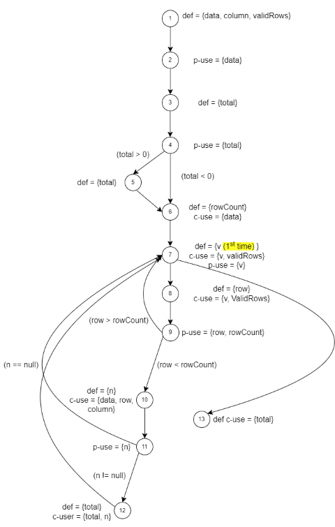

**SENG 637 - Dependability and Reliability of Software Systems**

**Lab. Report #3 – Code Coverage, Adequacy Criteria and Test Case Correlation**

| Group \#:      |     |
| -------------- | --- |
| Student Names: |     |
|                |     |
|                |     |
|                |     |

(Note that some labs require individual reports while others require one report
for each group. Please see each lab document for details.)

# 1 Introduction

The previous assignment focused on black box testing, while this assigment is focused on white box. This means we will be looking at the source code and determining the best way to test the functionality. Several techniques will be employed such as branch and statement coverage. This will allow the group to become familiar with white box testing and learn several options for testing code going forward.

# 2 Manual data-flow coverage calculations for X and Y methods

**DataUtilities.calculateColumnTotal:**

| Index | DEF                     | USE               | Code                                                                                    |
| ----- | ----------------------- | ----------------- | --------------------------------------------------------------------------------------- |
| 1     | data, column, validRows |                   | `public static double calculateColumnTotal(Values2D data, int column, int[] validRows)` |
| 2     |                         | data              | `ParamChecks.nullNotPermitted(data, "data");`                                           |
| 3     | total                   |                   | `double total = 0.0;`                                                                   |
| 4     |                         | total             | `if (total > 0){`                                                                       |
| 5     | total                   |                   | `total = 100;`                                                                          |
| 6     | rowCount                | data              | `int rowCount = data.getRowCount();`                                                    |
| 7     | v                       | validRows         | `for (int v = 0; v < validRows.length; v++){`                                           |
| 8     | row                     | validRows, v      | `int row = validRows[v];`                                                               |
| 9     |                         | row, rowCount     | `if (row < rowCount) {`                                                                 |
| 10    | n                       | data, row, column | `Number n = data.getValue(row, column);`                                                |
| 11    | n                       | n                 | `if (n != null) {`                                                                      |
| 12    | total                   | total, n          | `total += n.doubleValue();`                                                             |
| 13    |                         | total             | `return total;`                                                                         |

**Test Case 1: Data with null Values2D object**

- **Objective**: Error out on Values2D data
- **Input**: `data = null`, `column = 6`, `validRows = 9`.
- **Expected Result**: The method throws an exception for the null `data` object.

| Test Case               | Execution Path | DU Pairs | Coverage |
| ----------------------- | -------------- | -------- | -------- |
| Check for null Values2D |                |          | 64.7%    |

**Test Case 2: Data with an empty array of validRows**

- **Objective**: To cover the scenario where the loop does not iterate even once.
- **Input**: `data = positive 2D matrix`, `column = 6`, `validRows = empty array`.
- **Expected Result**: The method returns `0.0`.

| Test Case               | Execution Path | DU Pairs | Coverage |
| ----------------------- | -------------- | -------- | -------- |
| Check for null Values2D |                |          | 100%     |

**Test Case 3: Data with validRows containing indices higher than rowCount**

- **Objective**: To the case where the theres is more valid rows than matrix.
- **Input**: `data = positive 2D matrix`, `column = 6`, `validRows > data.getRowCount()`.
- **Expected Result**: The method returns `0.0` because the condition `row < rowCount` is false.

| Test Case               | Execution Path | DU Pairs | Coverage |
| ----------------------- | -------------- | -------- | -------- |
| Check for null Values2D |                |          | 20%      |

**Test Case 4: Data with validRows and some null values**

- **Objective**: To cover the false branch of the condition `if (n != null)`.
- **Input**: `data = positive 2D matrix will null rows`, `column = 6`, `validRows <= data.getRowCount()`.
- **Expected Result**: The method returns the sum of the non-null values in the specified column for the validRows.

| Test Case               | Execution Path | DU Pairs | Coverage |
| ----------------------- | -------------- | -------- | -------- |
| Check for null Values2D |                |          | 100%     |

**Test Case 5: Data with validRows and valid values 2D**

- **Objective**: To cover all lines.
- **Input**: `data = positive 2D matrix`, `column = 6`, `validRows <= data.getRowCount()`.
- **Expected Result**: The method returns the sum of the column for the validRows.

| Test Case               | Execution Path | DU Pairs | Coverage |
| ----------------------- | -------------- | -------- | -------- |
| Check for null Values2D |                |          | 100%     |

**Range.getLowerBound:**

DU-pairs:

upper: 1-3

lower: 1-3, 1-6

# 3 A detailed description of the testing strategy for the new unit test

Text…

# 4 A high level description of five selected test cases you have designed using coverage information, and how they have increased code coverage

Text…

# 5 A detailed report of the coverage achieved of each class and method (a screen shot from the code cover results in green and red color would suffice)

Text…

# 6 Pros and Cons of coverage tools used and Metrics you report

Text…

# 7 A comparison on the advantages and disadvantages of requirements-based test generation and coverage-based test generation.

Text…

# 8 A discussion on how the team work/effort was divided and managed

Text…

# 9 Any difficulties encountered, challenges overcome, and lessons learned from performing the lab

Text…

# 10 Comments/feedback on the lab itself

Text…
