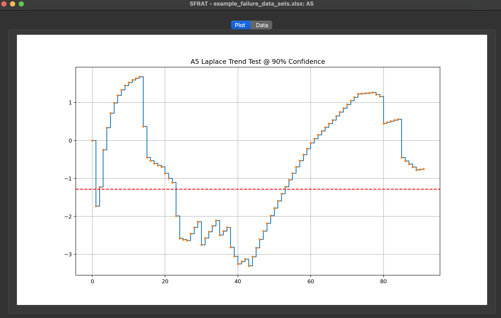
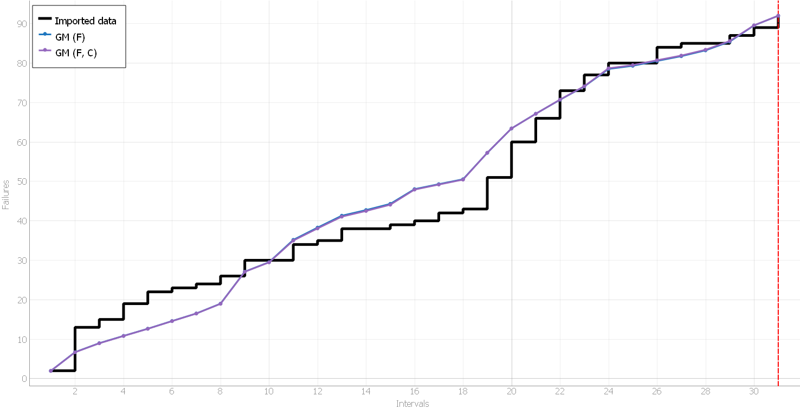
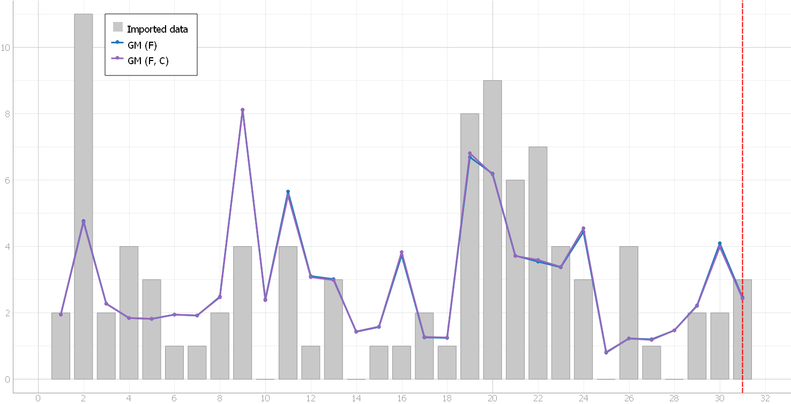

**SENG 637- Dependability and Reliability of Software Systems\***

**Lab. Report \#5 – Software Reliability Assessment**
| Group \#: 7 |
| -------------- |
| Student Names: |
| Carissa Chung |
| Benjamin Reid |
| Braden Tink |
| Christian Valdez |
| Alton Wong |

# Introduction

Using failure data, we can assess the reliability of a system under test (SUT). Our group utilized the C-SFRAT reliability growth assessment tool to generate plots of the failure rate and reliability of the SUT. Reliability Demonstration Char (RDC) is a good method for checking whether the target mean time to failure (MTTF) is met. It is based on collecting failure data at various time points.

# Assessment Using Reliability Growth Testing

### Laplace Test

The **Laplace test** was used to determine the trend in the failure rate of a system. Failure data were collected and plotted to achieve a **90% confidence level**. The **x-axis** displays the failure count, while the **y-axis** shows the Laplace value.

When the rate of change is **positive**, this indicates that the time between failures is decreasing, suggesting that failures are occurring more frequently. This could imply that the system or component is degrading or undergoing a wear-out process. Conversely, a **negative rate of change** suggests that the time between failures is increasing, implying that failures are becoming less frequent.

When the **Laplace value** is **above the red line**, it indicates that the system is likely becoming less reliable over time.

When the **Laplace value** is **below the red line**, this suggests an improvement in reliability.

| Interval | Trend Description                                   | Above Upper Threshold? | Interpretation                            |
| -------- | --------------------------------------------------- | ---------------------- | ----------------------------------------- |
| 0-30     | Decreasing sharply                                  | No                     | Improvement in reliability                |
| 30-50    | Initially significant improvement, then fluctuating | Yes and No             | Variable reliability, periods of concern  |
| 50-60    | Increasing sharply                                  | Yes                    | Deterioration in reliability              |
| 60-80    | Generally high with fluctuations                    | Yes                    | Continued concern for reliability         |
| 80-92    | Decreasing                                          | No                     | Indications of improvement in reliability |

### Heading

Testing for this assessment utilized the C-SFRAT and followed the steps outlined in the paper "A Covariate Software Tool to Guide Test Activity Allocation." Thus, the Weibull (DW2), Geometric (GM), and Second Order Negative Binomial (NB2) models were used. The comparison, using the Critic Mean, showed the best models to be the GM with covariate F (Critic score of 1.000), and the GM with covariates F and C (Critic score of 0.981).

# Assessment Using Reliability Demonstration Chart

#

# Comparison of Results

# Discussion on Similarity and Differences of the Two Techniques

# How the team work/effort was divided and managed

#

# Difficulties encountered, challenges overcome, and lessons learned

# Comments/feedback on the lab itself
